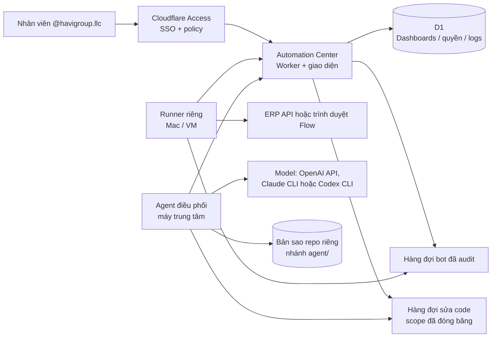

# Kiến trúc Automation Control Center

## Ranh giới chương trình

`dashboards` là đơn vị cô lập chính. Mọi bảng vận hành (`bots`, `approvals`, `dashboard_projects`, `audit_logs`, `dashboard_members`) đều mang `dashboard_id`. Mọi API chi tiết bắt buộc tải dashboard bằng slug rồi kiểm tra membership trước khi đọc hoặc ghi.

Owner nhìn được tất cả dashboard; các vai trò khác chỉ thấy dashboard có bản ghi membership tương ứng. Cấp quyền ở một dashboard không tạo membership ở dashboard khác.

## Vai trò và giới hạn

| Vai trò | Có thể làm | Không thể làm |
| --- | --- | --- |
| Owner | Tạo chương trình, toàn quyền chương trình, quản lý thành viên, gửi và duyệt thay đổi code | Không có cách đặt token trong UI. |
| Admin | Tạo/cấu hình bot, cấp quyền, chạy bot, duyệt, gửi và duyệt thay đổi code | Không tạo dashboard mới, không tự vào dashboard khác, không bật `auto_apply`. |
| Operator | Gửi lệnh chạy, tạm dừng, tiếp tục bot được gán, gửi yêu cầu sửa code | Không thêm user, đổi cấu hình, duyệt — kể cả yêu cầu code của chính mình. |
| Reviewer | Duyệt hoặc từ chối yêu cầu được tạo ở dashboard | Không chạy bot, đổi cấu hình hay gửi yêu cầu sửa code. |
| Viewer | Xem trạng thái, project, lịch sử | Không tạo thay đổi. |

## Runner và bí mật

Cloudflare Worker là control plane, không phải nơi chạy browser automation của Google Flow. Content Image Runner chạy trên máy công ty/VM và chủ động polling Worker qua Cloudflare Access Service Token; Google Flow chỉ lắng nghe `127.0.0.1` trên chính máy đó. Thiết kế runner phải:

- nhận `dashboard_id`, `bot_id`, `project_id` đã được Worker kiểm tra;
- từ chối target nằm ngoài dashboard/project được gán;
- không gửi API secret về browser hoặc audit log;
- trả kết quả, thời gian, lỗi đã làm sạch về Worker;
- dùng secret riêng cho từng connector/runner, xoay vòng được.

## Luồng Agent tạo ảnh Content

1. Operator nhập idea, số ảnh và tỷ lệ trong dashboard.
2. Worker chỉ tạo `bot_run` khi `content-image-runner` vừa heartbeat; nếu offline, không ghi lệnh và UI chỉ hiện hướng dẫn thiết lập.
3. Runner claim một lệnh `queued`, gửi nó vào Flow v2 tại localhost, rồi báo `running`.
4. Bấm **Dừng** khi queued sẽ đổi run thành `cancelled` ngay. Bấm khi running sẽ đổi thành `cancel_requested`; runner gọi endpoint stop của Flow rồi báo kết quả cuối cùng.
5. Khi hoàn tất, runner trả artifact về Worker. Worker tạo một yêu cầu duyệt cho từng ảnh và ghi audit log. Secret, prompt chi tiết và Access credential không hiển thị trong audit.

Không đặt ERP API key/secret trong `public/`, D1, Git hoặc form của Automation Center. Chỉ đưa chúng vào secret store của runner hay Cloudflare Worker, theo connector cần dùng. Khoá OpenAI của Agent điều phối cũng theo quy tắc này: chỉ nằm trong `.env` của runner trên máy trung tâm — và có thể để trống hẳn khi agent gọi model qua Claude CLI hay Codex CLI đã đăng nhập sẵn trên máy đó (thứ tự `auto`: OpenAI → Claude → Codex).

## Luồng Agent điều phối

Nhân viên nhắn yêu cầu sửa code; máy trung tâm đọc repo, gọi model (ChatGPT qua HTTP, hoặc Claude/Codex CLI tại chỗ), rồi chạy test. Máy cá nhân không tham gia.

QUYẾT ĐỊNH CÓ CHỦ Ý, 2026-09-01: hai đường CLI (Claude, Codex) chạy với **công cụ thật** — Bash, đọc/ghi file, mạng, MCP đã cấu hình sẵn — y như một phiên Claude Code hay Codex bình thường, không còn là "đường truyền chữ" như thiết kế ban đầu. Đây là lựa chọn có cân nhắc rủi ro của người vận hành, chạy thẳng trên máy trung tâm này (nơi giữ secret thật) thay vì cô lập ở một máy/VM riêng. Chi tiết và rủi ro còn lại nằm ở docstring đầu `runner/orchestrator_runner.py`; tóm tắt:

- `subprocess_env()` lọc các biến môi trường bí mật (secret runner, token/khoá ERP, credential Cloudflare Access) khỏi tiến trình CLI trước khi gọi model — giảm một đường lộ thừa, **không phải** một sandbox: model vẫn đọc được mọi file mà tài khoản hệ điều hành đọc được nếu nó chủ động đi tìm.
- Lớp chặn phạm vi/bảo vệ chuyển từ *trước khi ghi* sang *sau khi model xong việc*: không còn bước "runner ghi file hộ" để lọc trước, nên `validate_touched_paths()` soi lại toàn bộ diff sau đó — chạm file bảo vệ hay vượt phạm vi vẫn bị từ chối trước khi tới tay người duyệt, chỉ là chốt kiểm đứng sau thay vì trước.
- Cổng duyệt tay (bước 5-6 dưới đây) không còn là hàng rào kỹ thuật *duy nhất*: một model có Bash có thể tự `git commit`/`git push` nếu nó muốn. Bản clone của runner (`AGENT_REPO_DIR`) trong điều kiện bình thường không có credential push thật (dựng qua git-bundle vì máy trung tâm không đăng nhập GitHub) — đó là một sự trùng hợp về hạ tầng, không phải một chốt chặn được thiết kế.

1. Người dùng mở một thread và gửi tin nhắn. Worker kiểm `code_request`, đọc phạm vi được cấp, và **đóng băng** phạm vi đó vào `code_change_requests.scope_json`. Không có phạm vi → 403. Runner offline → 409, không ghi lệnh.
2. Runner claim yêu cầu `queued` → `planning`. Worker trả về chỉ thị, phạm vi đã đóng băng, danh sách bảo vệ toàn cục và 40 tin nhắn gần nhất của thread.
3. Runner checkout `agent/<id>` từ nhánh base trong **bản sao repo riêng** — TRƯỚC KHI gọi model, vì model có công cụ thật có thể tự sửa file ngay trong lúc "lên kế hoạch" — rồi lặp tối đa 4 vòng với model (`read` → `answer`, `edit` hoặc `bot`). Ở nhánh `edit`, model tự đọc/ghi file bằng công cụ của chính nó (không còn trả nội dung file qua JSON); runner chỉ `git add -A`, đo diff so với nhánh base, chạy `AGENT_TEST_COMMAND`, rồi commit hộ nếu model chưa tự commit.
4. Runner báo kết quả kèm diff, danh sách file, số dòng và log test. Worker kiểm lại danh sách file đó với `scope_json`: ngoài phạm vi, vượt trần file/dòng → ép `failed`. Chạm file bảo vệ → `touches_protected`, không bao giờ tự áp dụng. Số dòng lấy giá trị lớn hơn giữa số runner báo và số đếm được trong chính diff sẽ hiển thị cho người duyệt, nên báo thiếu không lách được trần.

   Đây là lớp chặn *lỗi* — lỗi logic hoặc model đi chệch ở runner. Nó **không** chặn được một runner đã bị chiếm: runner vẫn là bên cung cấp cả danh sách file lẫn `diff_text`. Bảo vệ trước tình huống đó nằm ở chỗ khác: secret của runner và nhánh `agent/<id>` chỉ tồn tại trên máy trung tâm.
5. Trong phạm vi + không chạm file bảo vệ + test xanh + phạm vi có `auto_apply` → `approved` thẳng. Còn lại → `awaiting_approval`, chờ người có `code_approve`. Người gửi không tự duyệt được, trừ Owner. Yêu cầu chạm file bảo vệ chỉ Owner duyệt được.
6. Runner nhận danh sách `approved`, merge nhánh vào base (đẩy remote nếu `AGENT_PUSH_REMOTE`), báo `applied`. Merge lỗi → `git merge --abort` rồi báo `failed`. Mọi lỗi giữa chừng đều `reset --hard`, `clean -fd`, quay về nhánh base và xoá nhánh tạm.

### Agent điều khiển bot khác

Yêu cầu kiểu "dừng bot tạo ảnh" không tạo commit hay diff nào: runner vẫn checkout `agent/<id>` như mọi yêu cầu khác (vì việc đó xảy ra trước khi biết model sẽ trả lời gì), nhưng ngay khi thấy `action: "bot"` thì dọn nhánh đó đi (`reset --hard`, `clean -fd`, quay về base, xoá nhánh) rồi mới báo `bot_action` kèm tối đa 5 lệnh. Worker kiểm `capability(requested_role, "run")` rồi gọi `runBotCommand` — đúng hàm mà nút bấm trên web gọi — và chốt yêu cầu ở `bot_done`. Actor ghi vào audit là `agent:<email người gửi>`, không phải một danh tính riêng của agent.

Lõi được tách ra dùng chung thay vì viết lại cho agent, vì lối vào của agent là lối ít bị soi hơn: một bản kiểm tra thứ hai sẽ trôi, và bên nới hơn mới là bên có hiệu lực. Runner cũng chỉ nhận được danh sách bot khi người gửi có quyền `run`, nên khi không có quyền thì ChatGPT không có `bot_id` nào để gọi tên.

Hai lớp kiểm phạm vi là cố ý trùng nhau: runner từ chối *ghi* file ngoài phạm vi, Worker từ chối *nhận* kết quả ngoài phạm vi. Runner giữ bản sao `PROTECTED_GLOBS` của riêng nó, nên một Center bị cấu hình sai vẫn không khiến nó đọc hay ghi file bí mật.

`automation_center/src/worker.js` nằm trong danh sách bảo vệ: agent không sửa được chính phần phân quyền đang ràng buộc nó mà không có Owner duyệt tay.

### Agent đọc dữ liệu ERP

Từ bản có công cụ thật (2026-09-01), model có Bash và mạng thật nên câu "model không bao giờ tự ra mạng" không còn đúng tuyệt đối nữa — nhưng đường vào ERP có chủ đích vẫn là vòng `read` đã dùng cho file repo: một "path" dạng `erp:MA_DU_AN`, `erp:MA_DU_AN/tasks` hoặc `erp:MA_TASK` (thay vì đường dẫn file) được runner nhận ra và tự gọi GraphQL của ERP (`erp_request`/`read_erp_resource` trong `runner/orchestrator_runner.py`), rồi trả kết quả về model dưới đúng dạng văn bản như khi đọc file. Đọc được mọi Project ERP, không khoá cứng một mã.

Lý do vòng `read` vẫn là đường chính chứ không phải chỉ còn tính hình thức: `subprocess_env()` lọc `ERP_BOT_TOKEN`/`ERP_API_KEY`/`ERP_API_SECRET` khỏi môi trường tiến trình CLI, nên model tự gọi ERP bằng Bash của chính nó sẽ không có sẵn credential thật để xác thực — nó chỉ còn cách xin runner gọi hộ qua vòng `read`.

Chỉ ba thao tác ĐỌC được nối vào đây (tổng quan dự án, board Task, một Task) — giống ba tool đọc của `mcp/hvg_erp_mcp.py`. Thao tác GHI (tạo Task, đổi trạng thái, thêm comment) cố tình không có đường vào luồng chat: MCP cá nhân đòi `confirmed=true` sau khi người dùng xác nhận trực tiếp trong phiên Codex, còn agent điều phối chạy nền không có bước xác nhận tương đương — nối thẳng thao tác ghi vào đây sẽ là nới quyền ngoài những gì người dùng đã cho phép. Credential đọc ERP (`ERP_BOT_TOKEN`, hoặc cặp `ERP_API_KEY`/`ERP_API_SECRET`) nằm trong `.env` của runner trên máy trung tâm, không đọc từ macOS Keychain — Keychain là của `mcp/hvg_erp_mcp.py` chạy trên máy cá nhân.

### API

| Endpoint | Ai gọi |
| --- | --- |
| `GET /api/dashboards/:slug/agent` | Người dùng — thread, yêu cầu, phạm vi của mình, trạng thái runner |
| `GET /api/dashboards/:slug/agent/threads/:id` | Người dùng — tin nhắn của một thread |
| `POST /api/dashboards/:slug/agent/threads` | `code_request` |
| `POST /api/dashboards/:slug/agent/threads/:id/messages` | `code_request` — 409 nếu thread còn yêu cầu đang chạy |
| `GET /api/dashboards/:slug/agent/requests/:id/diff` | Người dùng — tải diff khi bấm xem (không đi kèm danh sách) |
| `POST /api/dashboards/:slug/agent/requests/:id` | Duyệt/từ chối (`code_approve`); huỷ (người gửi **hoặc** người có `code_approve`) |
| `POST /api/dashboards/:slug/agent/scopes` | `manage_members`; `auto_apply` chỉ Owner |
| `POST /api/runner/code/claim` | Runner |
| `GET /api/runner/code/approved?runner_key=` | Runner |
| `GET \| POST /api/runner/code/:id` | Runner |

Ranh giới quyền được khoá bằng `tests/permissions.test.mjs`, `tests/test_scope_parity.py` và `tests/test_orchestrator_bot.py`.
